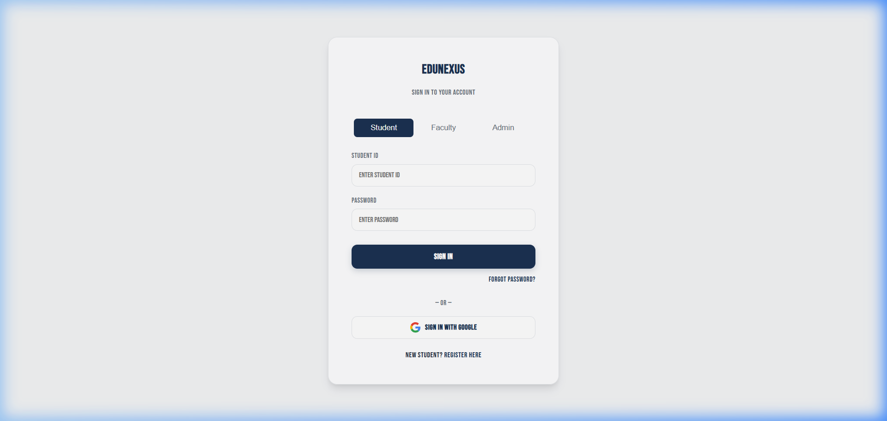
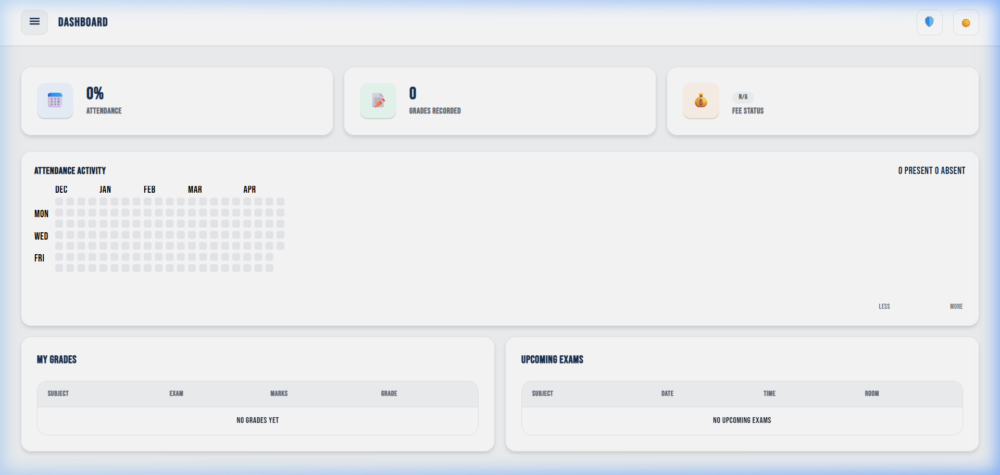
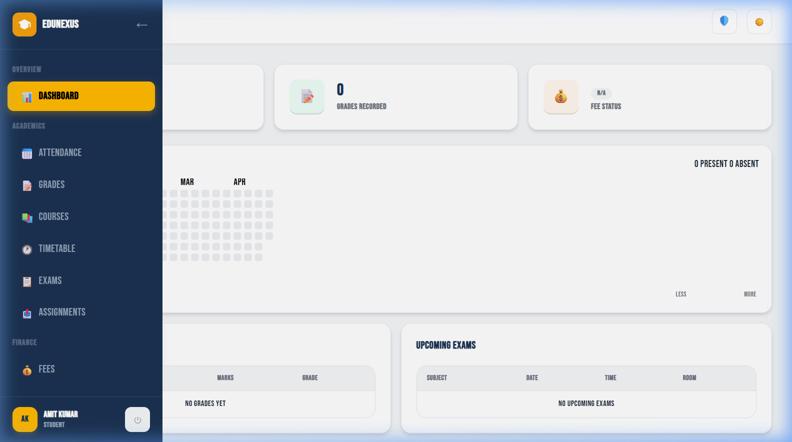

<div align="center">

# 🎓 EduNexus ERP

### Modern College Enterprise Resource Planning System

[](https://firebase.google.com/)
[](https://www.chartjs.org/)
[](https://developer.mozilla.org/en-US/docs/Web/JavaScript)
[](https://developer.mozilla.org/en-US/docs/Web/CSS)
[](LICENSE)

<br/>

A full-featured, role-based **College ERP** built with vanilla HTML, CSS & JavaScript — powered by **Firebase** for real-time authentication and cloud data storage. Designed with a premium dark/light mode UI, glassmorphism aesthetics, and interactive data visualizations.

<br/>

</div>

<div align="center">
  
  <br/>
  
  
</div>

---

## ✨ Features

### 🔐 Authentication & Access Control
- **Multi-role login** — Student ID, Faculty ID, or Admin email-based authentication
- **Google Sign-In** — One-click OAuth via Firebase Auth popup
- **Role-based routing** — Automatic redirection based on user role (Admin / Faculty / Student)
- **Forgot Password** — Firebase-powered email reset for all user types
- **Auth Guards** — Protected routes with session validation on every page

### 📊 Admin Dashboard
- **KPI stat cards** — Total Students, Faculty, Courses, and Avg Attendance at a glance
- **Interactive charts** — Attendance bar chart and Fee Collection doughnut (Chart.js) with hover animations
- **Recent students** — Quick-access table of the latest enrolled students

### 👨‍🎓 Student Management
- Full CRUD operations with searchable, sortable data tables
- Admin can create student accounts with auto-generated Firebase Auth credentials
- Per-student profiles linked via Firestore document IDs

### 👩‍🏫 Faculty Management
- Add, edit, and remove faculty members
- Subject assignment and department classification
- Faculty-specific dashboard with assigned courses view

### 📚 Course Management
- Course creation with code, credits, semester, and department fields
- Faculty assignment per course
- Searchable course catalog

### 📅 Attendance Tracking
- Mark attendance by subject and date (Present / Absent / Late)
- Student-facing attendance percentage view
- Admin/Faculty attendance charts and analytics

### 📝 Grades & Exams
- Faculty can submit grades per student per subject
- Exam scheduling with date, time, room, and semester filtering
- Student-facing grade report with badge indicators

### 🕐 Timetable
- Interactive weekly timetable grid (Monday–Saturday)
- Slot-based scheduling with subject, faculty, and room assignment
- Color-coded visual layout

### 📤 Assignments
- Assignment creation with Google Drive link submissions
- Status tracking per student

### 💰 Fee Management
- Fee records with expected, collected, and balance amounts
- Status badges (Paid / Partial / Unpaid)
- CSV export for financial reporting
- Animated doughnut chart with dynamic center text on dashboard

### 🎨 Design & UX
- **Light & Dark mode** with one-click toggle
- **Glassmorphism** cards and top bar with backdrop blur
- **Responsive** — slide-in sidebar for mobile, full layout for desktop
- **Micro-animations** — hover effects, card lifts, smooth transitions
- **Custom design system** — CSS custom properties for consistent theming
- **Outfit & Inter fonts** — Premium Google Fonts typography

---

## 🏗️ Tech Stack

| Layer | Technology |
|:------|:-----------|
| **Frontend** | HTML5, CSS3 (Custom Properties), Vanilla JavaScript (ES6+) |
| **Auth** | Firebase Authentication (Email/Password + Google OAuth) |
| **Database** | Cloud Firestore (NoSQL, real-time) |
| **Charts** | Chart.js v4 |
| **Fonts** | Google Fonts — Inter, Bebas Neue, Outfit |
| **Icons** | Emoji-based + inline SVG |
| **Hosting** | Static — deploy anywhere (Netlify, Vercel, Firebase Hosting, GitHub Pages) |

---

## 📁 Project Structure

```
EduNexus-ERP/
├── index.html                  # Login page
├── register.html               # Student self-registration
├── README.md
│
├── assets/
│   ├── css/
│   │   └── styles.css          # Complete design system & components
│   ├── img/
│   │   └── favicon.svg         # SVG favicon (graduation cap)
│   └── js/
│       ├── firebase-config.js  # Firebase project configuration
│       ├── auth.js             # Authentication module (login, register, guards)
│       ├── storage.js          # Firestore CRUD abstraction layer
│       ├── utils.js            # Shared utilities (toasts, modals, forms, CSV export)
│       ├── sidebar.js          # Sidebar navigation & role-based menu
│       ├── dashboard.js        # Dashboard charts & KPI rendering
│       ├── students.js         # Student management module
│       ├── faculty.js          # Faculty management module
│       ├── courses.js          # Course management module
│       ├── attendance.js       # Attendance tracking module
│       ├── grades.js           # Grade submission module
│       ├── exams.js            # Exam scheduling module
│       ├── timetable.js        # Timetable grid module
│       ├── fees.js             # Fee management module
│       └── assignments.js      # Assignments module
│
├── pages/
│   ├── dashboard.html          # Main dashboard (role-adaptive)
│   ├── students.html           # Student management
│   ├── faculty.html            # Faculty management
│   ├── courses.html            # Course catalog
│   ├── attendance.html         # Attendance tracking
│   ├── grades.html             # Grade management
│   ├── exams.html              # Exam scheduling
│   ├── timetable.html          # Weekly timetable
│   ├── fees.html               # Fee management
│   └── assignments.html        # Assignments
│
└── data/
    └── seed.js                 # Demo data seeder for development
```

---

## 🚀 Getting Started

### Prerequisites

- A modern web browser (Chrome, Firefox, Edge, Safari)
- A [Firebase](https://console.firebase.google.com/) project with **Authentication** and **Cloud Firestore** enabled

### 1. Clone the Repository

```bash
git clone https://github.com/Vedd023/College-ERP.git
cd College-ERP
```

### 2. Configure Firebase

Open `assets/js/firebase-config.js` and replace the placeholder config with your Firebase project credentials:

```javascript
const firebaseConfig = {
  apiKey: "YOUR_API_KEY",
  authDomain: "YOUR_PROJECT.firebaseapp.com",
  projectId: "YOUR_PROJECT_ID",
  storageBucket: "YOUR_PROJECT.appspot.com",
  messagingSenderId: "YOUR_SENDER_ID",
  appId: "YOUR_APP_ID"
};
```

### 3. Enable Firebase Services

In your Firebase Console:

1. **Authentication** → Enable **Email/Password** and **Google** sign-in providers
2. **Cloud Firestore** → Create a database (start in **test mode** for development)

### 4. Launch

Simply open `index.html` in your browser, or use a local dev server:

```bash
# Using Python
python -m http.server 8080

# Using Node.js
npx serve .

# Using VS Code
# Install "Live Server" extension → Right-click index.html → "Open with Live Server"
```

### 5. Create an Admin Account

1. In Firebase Console → **Authentication** → **Add User** → Enter an email & password
2. In **Cloud Firestore** → Create a document in the `users` collection:
   ```json
   {
     "uid": "<firebase-auth-uid>",
     "email": "admin@college.edu",
     "name": "Admin User",
     "role": "admin"
   }
   ```
3. Log in with the admin email to access the full admin dashboard

---

## 👥 User Roles

| Role | Login Method | Capabilities |
|:-----|:-------------|:-------------|
| **Admin** | Email & Password | Full CRUD on all modules, create student/faculty accounts, manage fees, export data |
| **Faculty** | Faculty ID & Password | View assigned courses, mark attendance, submit grades, view timetable & exams |
| **Student** | Student ID & Password | View personal attendance, grades, fees, timetable, exams, and submit assignments |

---

## 🌗 Theme Support

EduNexus supports **Light** and **Dark** modes with a single toggle button in the top bar. The theme preference persists across sessions using `localStorage`. All UI components adapt automatically via CSS custom properties.

---

## 📄 License

This project is open source and available under the [MIT License](LICENSE).

---

<div align="center">

**Built with ❤️ by Ved Dixit**

</div>